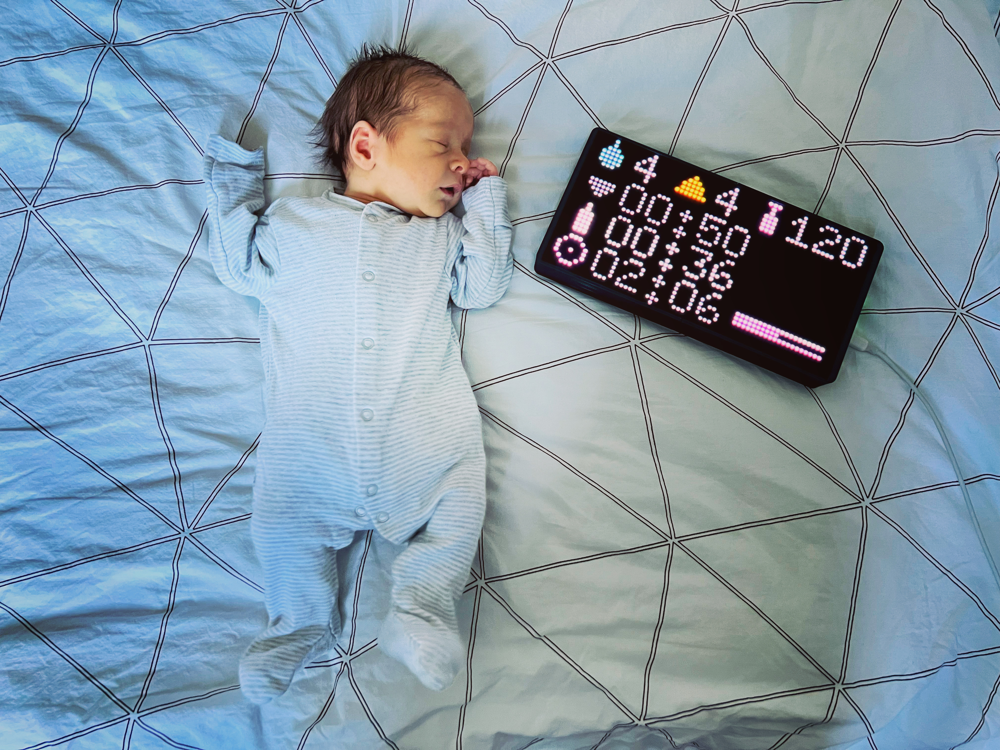

# babyportal

## Intro

We started using the [babytracker](https://nighp.com/babytracker/) app by nighp when we had our baby, to keep track of feeds, nappies and so on. We use it on iPhones and APple Watches, but I have a bunch of RGB LED matrixes from other projects and thought it would be useful to be able to glance at them and see how long since he's been fed, or whatever. Helpful when you don't have your hands free, or don't want to reach over in bed.

So! First problem is how to get data out of the app. The app (which I recommend btw) lets you export to CSV or backup the account, but doesn't have a real time API. I ended up using an Android VM and inspecting the database every couple of minutes.

Second problem is how to turn the database into a small number of useful values. I hacked together some sqlite queries to produce things like the number of poos he's done today in total.

Then it's fairly easy - I publish those values to an MQTT server, and the matrix runs some circuit python to display them with some icons. All the code is in the repository - babytracker.py does the data extraction and the matrixportal code displays it on an adafruit matrixportal M4.

Note - if you're not yet using a baby tracker at all, there are more open ones out there, with APIs or similar. I don't know if they've got all the features of the big commercial ones though. But I'm sort of taking the long way round here because I already had a month's data in this particular app, so I'm not saying this is the easiest way to do this sort of thing!

Also note - I'm nothing to do with the app developers, and I think it's a good app, I pay for the pro version. This project doesn't mess with the app itself or talk to their servers at all, and hopefully adds something for the few people who like doing extra things with their local data.

## What you need

To display the data somewhere, just an Android VM, an MQTT server, and a box you can run some basic python on. You can have whatever you want (Home Assistant maybe, or some code on a tablet) read the values from MQTT. So if you just want to know how to do that, really just read the Android part of the howto and look at the babytracker.py code.

To display the data on an RGB matrix like mine you'd need:

1. [A MatrixPortal M4](https://www.adafruit.com/product/4745). There's now a newer [S3 version](https://www.adafruit.com/product/5778) of the same product with more memory , the code would probably need a little tweaking to work on that, but only a little.
2. A P4, 64x32 RGB matrix panel (I get mine from Aliexpress)
3. The [case I designed](https://www.thingiverse.com/thing:5701517)
4. An [adafruit acrylic diffuser](https://www.adafruit.com/product/4749) - available various places
5. 6 M3 screws. Think mine are 8mm long, little bit more would be OK, shorter probably a problem.
6. Optional: [Uglu dashes](https://www.protapes.com/products/uglu-600-dashes-sheets) to stick the diffuser on, the case holds mine on pretty well though 

## How-To

1. Set up an Android VM on something, using an ISO from https://www.android-x86.org/. I pretty much just followed [this video](https://www.youtube.com/watch?v=pLSzeSu1GjM) since I use Proxmox. It's pretty straightforward though.
2. Add a Google account, and download the babytracker app from the play store, log in with your babytracker account.
3. Install Tasker from the play store. Add a scheduled task to scp the app database files (/data/data/com.nighp.babytracker_android/databases/babytracker*) to your local box of choice, I do it every 2 mins. The wildcard is important because you want the wal file as well as .dbfile so sqlite can see the most recent events which haven't been committed to the database yet (it will do this automatically as long as the files are in the same dir). You'll need to check "run as root" or it won't be allowed to see the app path. I also had to mess around with keys to make this programmatic and not have it ask for a password each time - in the end I created SSH keys on a different box, put the private key in /data/media (the only place where I could then assign it the right 600 permissions so SSH didn't complain), specified that as a -i argument in the SCP command, and added the public key to authorized_keys at the other end.
4. Prepare an MQTT server somewhere
5. Run babytracker.py wherever you've put the database (I have the cron run it every minute), and give it the details for your MQTT server. (There might be a way to do all this directly on the Android VM, but I found it easiest to get things off it ASAP and into an environment where's it's easier to do stuff).
6. If you're using a matrixportal, prep it using the [adafruit instructions](https://learn.adafruit.com/adafruit-matrixportal-m4/prep-the-matrixportal), paying particular attention to the [circuitpython part](https://learn.adafruit.com/adafruit-matrixportal-m4/prep-the-matrixportal)
7. Copy code.py, graphics.py, secrets.py and the bmp, fonts and lib directories onto your matrixportal device over USB.  Update secrets.py with your WiFi and MQTT details, and it should hopefully work. If not, run putty or something to see what it's saying on the serial port.

